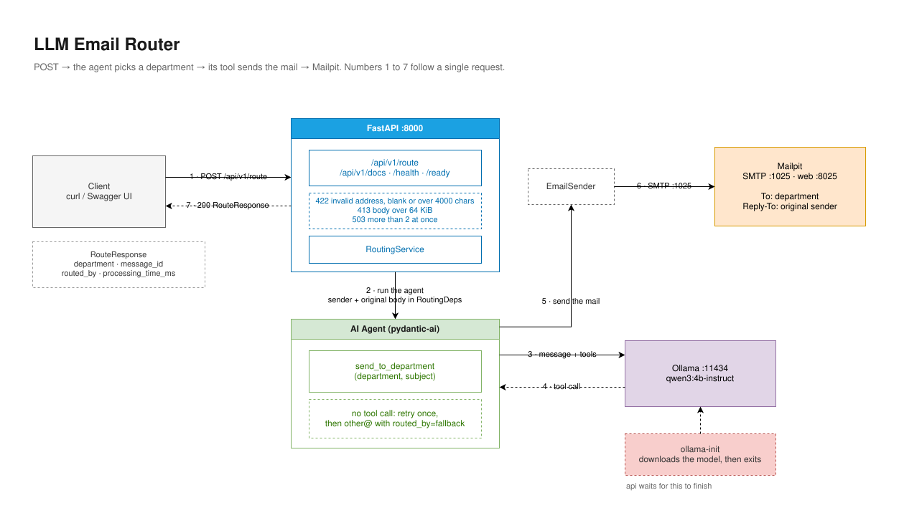

# LLM Email Router

An HTTP endpoint takes `{email, message}`, a local LLM agent decides which internal
department should handle it, and the agent sends the mail itself through a tool
call. Targets are `kadry`, `human-resources`, `help-desk`, `it` and `other`.
Everything runs in containers; no external API is called.

## Running it

```bash
docker compose up -d
```

The command returns when the API is actually serving, not when the containers have
merely started. First run downloads ~2.5 GB of model weights.

No `.env` is needed. Every setting has a default in `docker-compose.yml` and in
`app/config.py`; copy `.env.example` only if you want to change one.

```bash
curl -s -X POST http://localhost:8000/api/v1/route \
  -H "Content-Type: application/json" \
  -d '{"email": "jan.nowak@example.com", "message": "Nie działa mi drukarka od rana."}'
```

```json
{
  "department": "help-desk@example.com",
  "subject": "Awaria drukarki",
  "message_id": "<...@...>",
  "routed_by": "agent",
  "processing_time_ms": 4380
}
```

| | |
|---|---|
| Swagger UI | http://localhost:8000/api/v1/docs |
| Mailpit inbox | http://localhost:8025 |
| `/health` | process is alive, no dependency checks |
| `/ready` | Ollama, the model and SMTP are reachable |

## How it works



The agent gets one tool, `send_to_department(department, subject)`. `department` is
a five-value enum, so it cannot invent an address. The message body and the
`Reply-To` header come from the HTTP request through `RoutingDeps` and never pass
through model output, so nothing the sender writes can redirect the reply address or
rewrite the forwarded text. The run stops the moment the tool succeeds.

If the model produces no tool call, or one that fails validation, the request is
retried once with a stricter prompt. If that also fails the application sends to
`other@` itself and the response says `routed_by: "fallback"`.

`docs/ARCHITECTURE.md` covers the rest: the tool contract, the department scopes,
the model evaluation, container startup and the known limits.

## Layout

```
app/
├── main.py         FastAPI, endpoints, lifespan, error handlers, logging
├── config.py       Settings via pydantic-settings
├── models.py       Request and response models
├── guards.py       Concurrency semaphore
├── middleware.py   Body size limit at the ASGI level
├── ports.py        EmailSender Protocol
├── services.py     RoutingService
├── agent/          Agent, tool, department enum, Polish system prompt
└── adapters/       SMTP and in-memory EmailSender
eval/               35 labelled Polish messages and a scoring harness
tests/              44 unit tests, 2 e2e behind the llm marker
```

## Tests

```bash
docker compose run --rm tests                   # unit
docker compose run --rm tests pytest -m llm -q  # e2e, needs the stack up
```

Or locally, with a venv:

```bash
python3.13 -m venv .venv && .venv/bin/pip install -r requirements-dev.txt
.venv/bin/pytest -q
```

## Evaluation

```bash
docker compose cp eval api:/app/
docker compose exec -T api python -m eval.run_eval
docker compose exec -T api python -m eval.run_eval --model llama3.2:3b --limit 8
```

`qwen3:4b-instruct` was selected: 29/29 on the tuned set and 6/6 on the held-out
set, against 18/29 and 3/6 for `llama3.2:3b`. Numbers and caveats in
`docs/ARCHITECTURE.md`.

## Measured

| Platform | Inference | Per request |
|---|---|---|
| macOS arm64 (Apple Silicon) | CPU | 3.5-5.6 s |
| Fedora 43 x86_64 | CPU | 3.74-3.98 s |
| Fedora 43 x86_64 + AMD RX 9070 XT | ROCm | 0.73-0.77 s |

```bash
docker compose -f docker-compose.yml -f docker-compose.rocm.yml up -d
docker compose -f docker-compose.yml -f docker-compose.cuda.yml up -d
```

The CUDA override has never been run on GPU hardware.
